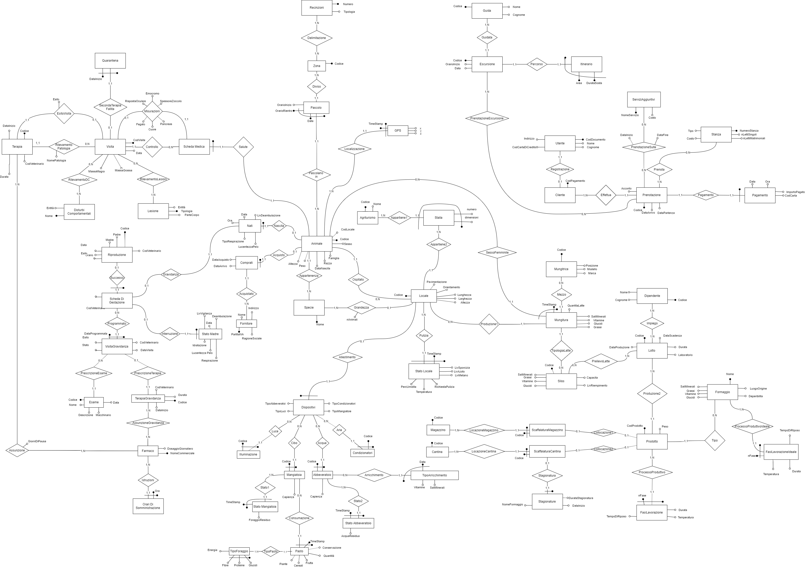

# DB for a farmhouse 4.0

MySQL database for a fictional farmhouse.

  

### Resources

- [Entity Relationship Diagram (ERD)](docs/er-diagram.png)
- Documentation ([PDF](docs/Report.pdf), in Italian)
- Requirements ([PDF](docs/Requirements.pdf), in Italian)
